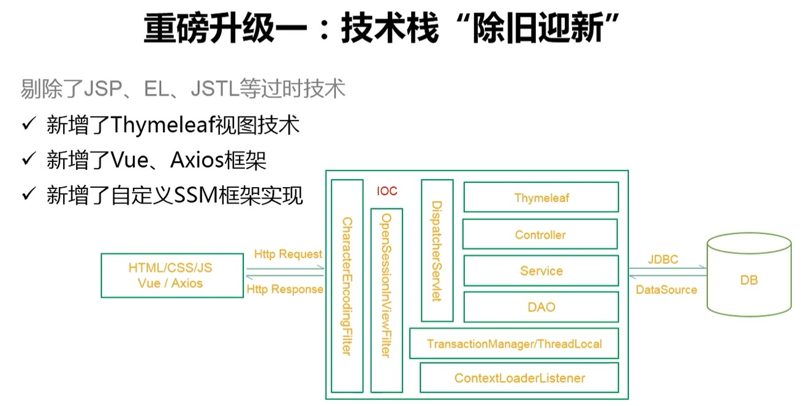
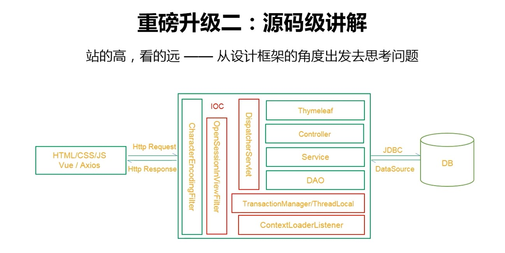
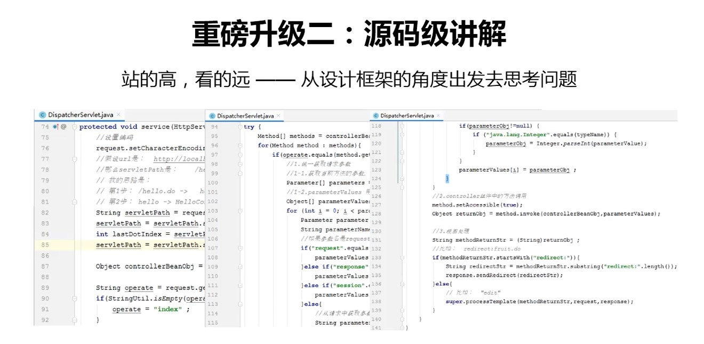
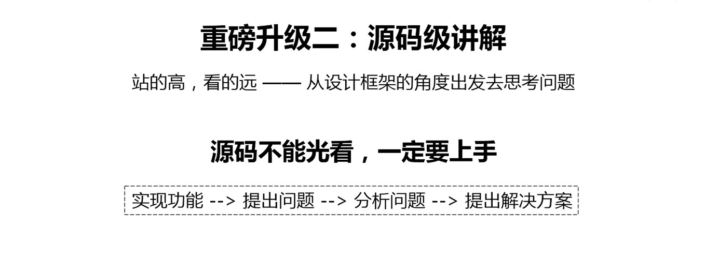
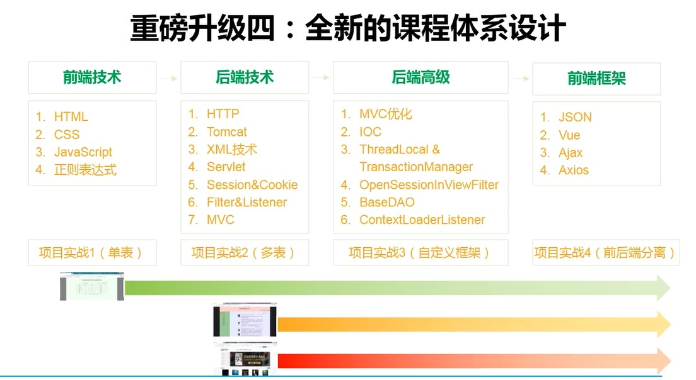

## 学习目标：
1. 使用idea创建并发布一个java web项目
2. servlet初体验
3. 手撕一个Spring MVC框架，体验一个框架一步一步进化的过程及其设计指导思想
4. 
**技术栈**

**功能点**
对项目的持久层，控制层，ioc，事务做了通用解决方案的实现。

以控制层为例，抽取实现了中央控制器，完成了三大步骤的操作：参数获取，目标方法调用，视图处理

学习编程不能光看，要上手。这里先动手写代码实现功能，然后提出问题（不是功能实现上的问题，而是系统架构层次的问题），然后分析问题，写代码验证解决方案。实现编程思维模式的升级，让你既知皮毛，又知内里。

项目实战安排更合理，一步步进化，用不同项目训练对应的技术

视频地址：https://www.bilibili.com/video/BV1AS4y177xJ/?vd_source=93b849a2e05b8dcf37cd770c34797c3c
原生笔记：https://heavy_code_industry.gitee.io/code_heavy_industry/pro001-javaweb/lecture/
https://heavy_code_industry.gitee.io/code_heavy_industry/pro001-javaweb/
https://www.wolai.com/nnRjHcUSv2mrRbFKZUpBMS
### Tomcat入门
建一个空网站：在webapp文件夹里，建一个文件夹【webTest】，这个文件夹里再建一个WEB-INFO文件夹。
就建好了一个空网站。
通过localhost:8080/webTest就可以访问了。webTest称为context-root
### java web初体验
idea 打开一个项目步骤
1. Settings里指定Maven，版本不合适的Maven会导致依赖发现失败
2. Project Structure里，指定sdk，language level

idea 创建并运行一个web模块
1. 创建一个web模块
2. 添加sevelet库依赖，在Project Structure里添加tomcat的sevelet-api.jar 依赖,或者添加tomcat库依赖
3. 创建一个artifact
5. add a run configuration ，attach tomcat
6. 在Deploy选项卡下，选上建好的artifact

导入现有的模块到当前项目
拷贝至当前项目目录下，Project Structure->Import Module
注：如果web文件夹没有蓝色方块，需要到Project Structure里面添加Facets->web
### servlet初体验
### 手撕Spring MVC
避免servlet类爆炸，建一个中央处理器，专门负责http请求参数解析和响应数据包装，分发请求，请求转发等。这样，我们在开发项目时，能更专注于业务类，精力可以更聚焦于业务逻辑的处理。业务类就是后面我们以后需要天天打交道的Controller类。
一个Contrller类就是我们以前的IOC容器中普通的bean对象。用一个框架将servlet的相关处理封装了起来，不再与我们的业务杂糅在一起，与我们的业务实现了解耦。
用到了反射技术，符合高内聚低耦合的软件设计思想。

1. 请求转发
包含路由，将一个请求路径匹配一个业务类（Controller类）的方法
